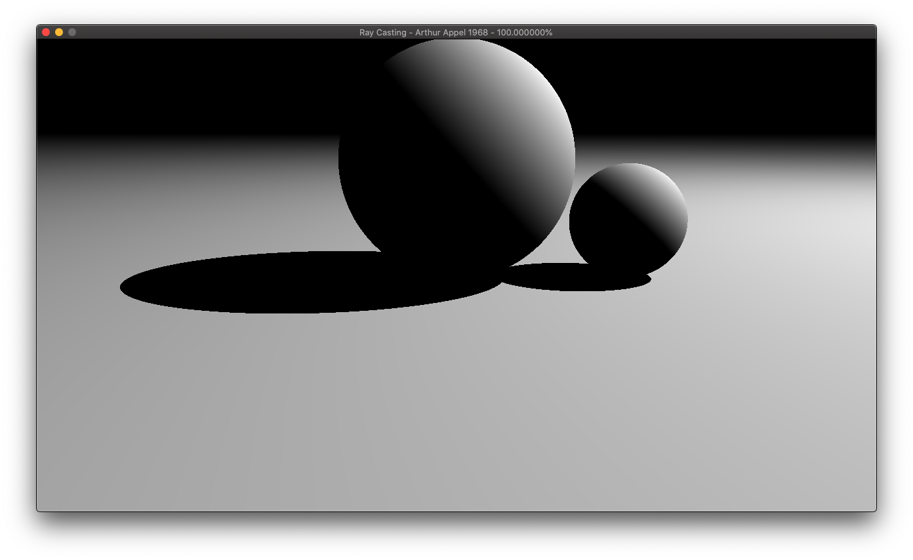
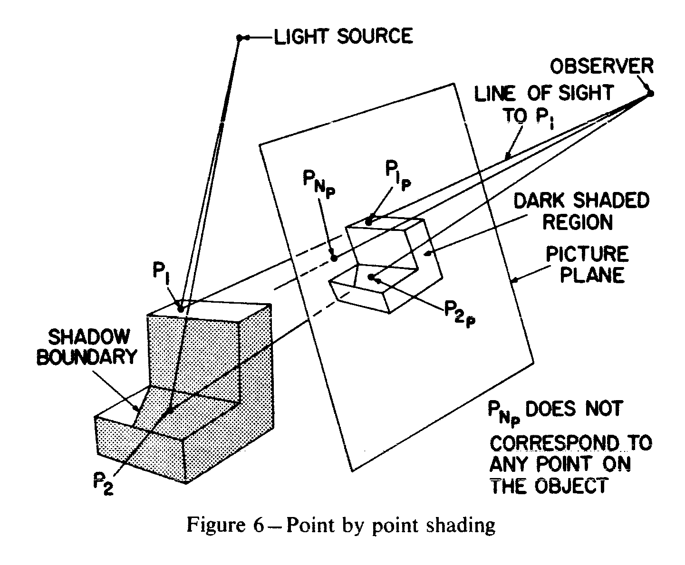

# Ray Casting - Arthur Appel, 1968

## 代码说明

因为原文实现的 Shading Model 主要是针对“数字绘图仪( digital plotter )，所以有一些点没有完全复现原文的做法：
- 原文中计算的 H 因子，用来控制一个 darkness mark 的大小，在这里直接用作来像素的 grayscale；

## 原文摘要

1. Determine the range of coordinates of the projection of the vertex points.
2. Within this range generate a roster of spots ( $P_{ip}$ ) in the picture plane, reproject these spots one at a time to the eye of the observer and generate the equation of the line of sight to that spot.
3. Determine the first plane the line of sight to a particular spot pierces. Locate the piercing point ( $P_i$) in space. Ignore the spots that do not correspond to points in the scene ( $P_{np}$ ).
4. Determine whether the piercing point is hidden from the light source by any other surface. If the point is hidden from the light source (for example $P_2$ ) or if the surface the piercing point is on is being observed from its shadow side, mark on the roster spot the largest allowable plus sign $H_s$. If the point in space is visible to the light source (for example $P_x$) draw a plus sign with dimension $H_j$ as determined by Equation 1.

$$
H_j = 1 — Cosine L
$$

