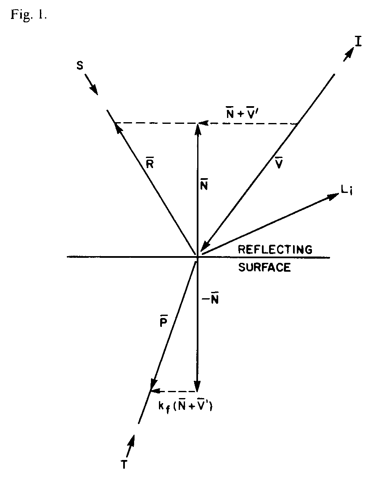
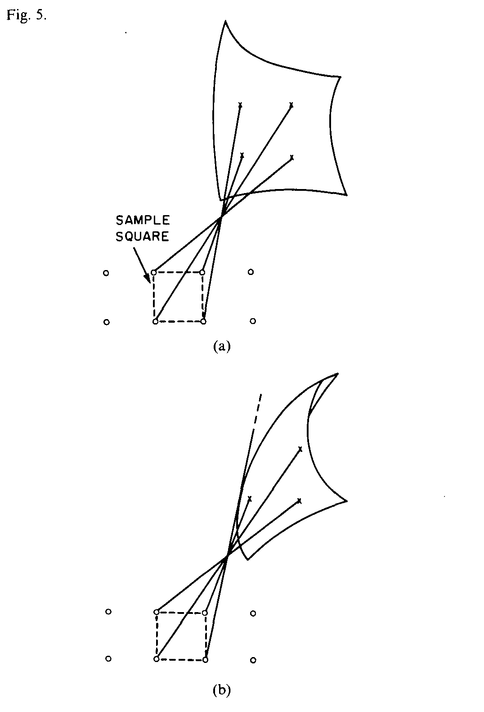

# Recursive Ray Tracing - Turner Whitted, 1980

## 原文摘要

### Conventional Models

$$
I = I_a + k_d \sum_{j=1}^{j=ls} (\vec{N} \cdot \vec{L_j}) + k_s \sum_{j=1}^{j=ls} (\vec{N} \cdot \vec{\acute{L_j}})^n
$$

where
- $I$ = the reflected intensity
- $I_a$ = reflection due to ambient light
- $k_d$ = diffuse reflection constant
- $\vec{N}$ = unit surface normal
- $\vec{L_j}$ = the vector in the direction of the jth light source
- $k_s$ = the specular reflection coefficient
- $\vec{\acute{L_j}}$ = the vector in the direction halfway between the viewer and the jth light source
- $n$ = an exponent that depends on the glossiness of the surface.

### Improved Model

$$
I = I_a + k_d \sum_{j=1}^{j=ls} (\vec{N} \cdot \vec{L_j}) + k_s S + k_t T
$$

where
- $S$ = the intensity of light incident from the $\vec{R}$ direction
- $k_t$ = the transmission coefficient
- $T$ = the intensity of light from the $\vec{P}$ direction.

### Visible Surface Processor

- bounding volume
- anti-aliasing

## Blinn-Phong Shading Model

> A very simple and widely used model for specular highlights was proposed by Phong (Phong, 1975) and later updated by Blinn (J. F. Blinn, 1976) to the form most commonly used today. 
> Steve Marschner. “Fundamentals of Computer Graphics, Fourth Edition, 4th Edition.” 

- [Phong, B.-T. (1975). Illumination for Computer Generated Images. Communications of the ACM , 18 (6), 311–317.](./1976-Blinn-Phong/360825.360839.pdf)
- [Blinn, J. F (1976). Texture and Reflection in Computer Generated Images. Communications of the ACM, 19 (10), 542-547.](./1976-Blinn-Phong/360349.360353.pdf)

