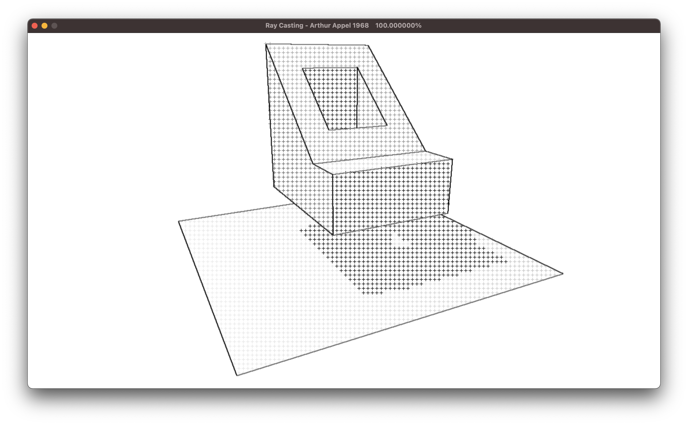
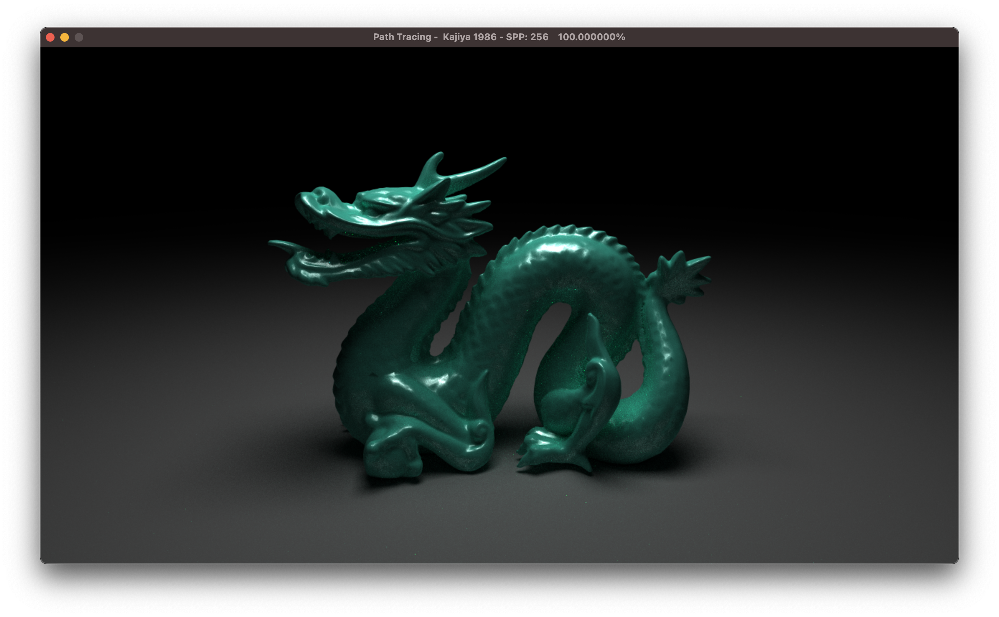
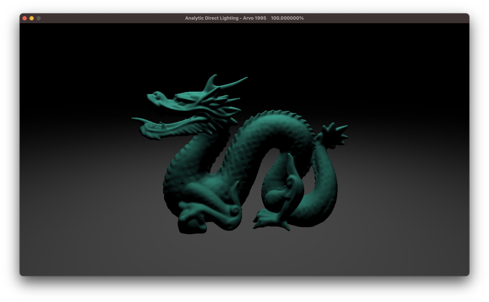

# [WIP] 50 Years of Ray Tracing

用代码叙述光线追踪技术对发展历程：从1968年它诞生到2018年实时光线追踪发布

- 以历史的发展的眼光学习光线追踪技术，将其中的一些关键对推进作用对文章找出来，并进行代码实践&练习
- 提供尽量简单，直观的 CPU 算法实现；代码的简单/易理解为首位，不太考虑性能优化
- 使用现代 C++ 编程
- 一个基础库 RTKit
   - 1.0 版是完全自己在这个 repo 了一点点写起来的
   - 2.0 版将底层改用 [Intel Embree](https://www.embree.org/) 用来进行光线与场景求交

## 文章列表

| 算法名称 | 文件夹  |  作者    |  文章标题    |
| -- | --  |  --  |  --  |
| Ray Casting |  1968.Appel   | Arthur Appel |  Some techniques for shading machine renderings of solids    |
| Recursive Ray Tracing |  1979.Whitted | Turner Whitted  |  An improved illumination model for shaded display   |
| Distributed Ray Tracing |  1984.Cook    | Robert Cook et al. | Distributed ray tracing  |
| Path Tracing |  1986.Kajiya  | James Kajiya | The rendering equation  |
| Bidirectional Light Transport | 1994.Veach.BDPT | Eric Veach | Bidirectional Estimators for Light Transport |
| Analytic Direct Lighting |  1995.Arvo  | James Richard Arvo | Analytic Methods for Simulated Light Transport |
| Multiple Importance Sampling | 1995.Veach.MIS | Eric Veach et al. | Optimally Combining Sampling Techniques for Monte Carlo Rendering |
| Photon Mapping|  1996.Henrik  | Henrik Wann Jensen | Global Illumination using Photon Maps  |
| Monte Carlo Direct Lighting|  1996.Shirley  | Peter Shirley et al. | Monte Carlo Techniques for Direct Lighting Calculations  |
| Metropolis Light Transport|  1997.Vaech.MLT  |Eric Veach & Leonidas Guibas | Metropolis Light Transport |

## 工程配置

- 安装 vcpkg 及依赖库
- VSCode 配置

## Ray Casting - Arthur Appel, 1968

- [x] Resolve visibility & depth
- [x] Lambertian shading
- [x] Sharp shadow

## Recursive Ray Tracing - Turner Whitted, 1980

- [x] Blinn–Phong shading
- [x] Reflection
- [x] Refraction

## Distributed Ray Tracing - Robert Cook et al., 1984

- [x] Soft shadow
- [x] Depth of field
- [x] Glossy reflection
- [x] Motion blur

## Path Tracing - James Kajiya, 1986

- [x] Monte Carlo Direct lighting
- [x] Indirect lighting with Russian Roulette termination
- [x] Next Event Estimation

## Analytic Direct Lighting - Arvo 1995

## Multiple Importance Sampling - Eric Veach et al., 1995

- [ ] TODO
- [ ] Phong Importance Sampling
- [ ] Distant Environment Lighting
- [ ] Importance Sampling GGX

## My Ray Tracing Kit

- [x] Cross platform: MacOS, Windows 10
- [x] Multi-threaded rendering

### RTKit1

- [x] Scene object instancing
- [x] Triangle mesh with BVH

### RTKit2

- Towards Physically-based Rendering
- Embree for intersection
