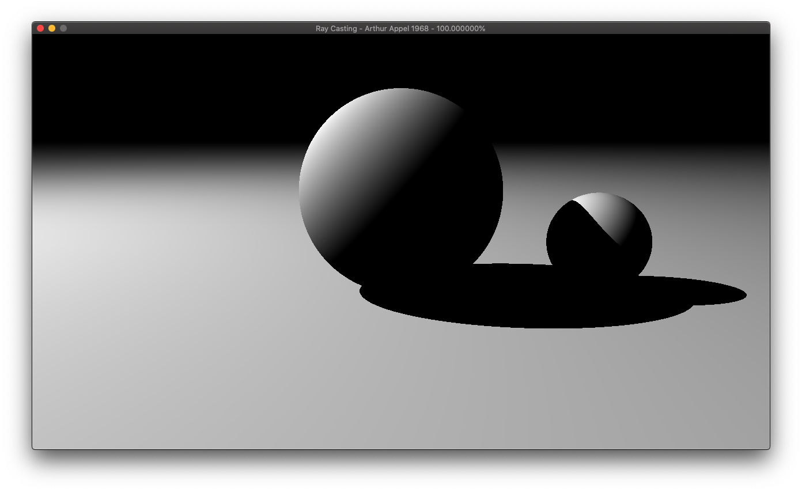
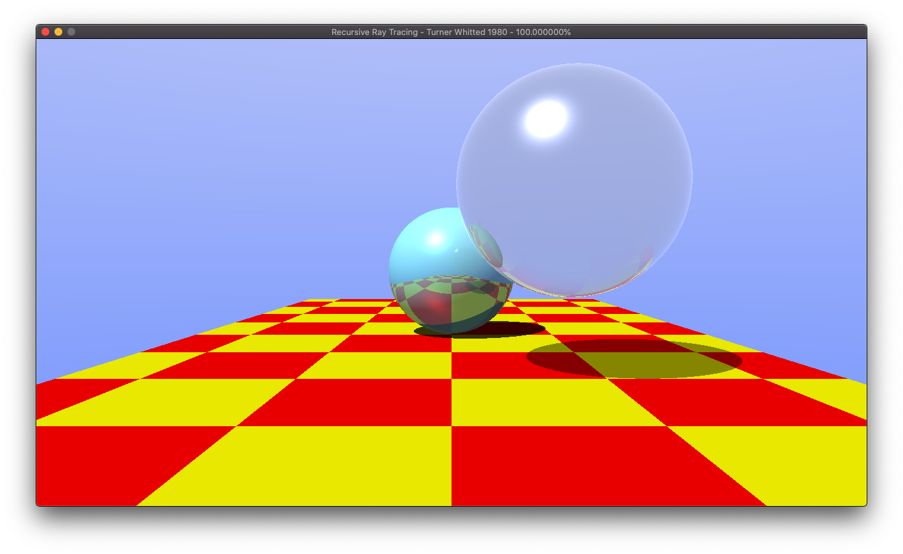

# 光线追踪简史 

用代码叙述光线追踪技术对发展历程

- 回看光线追踪的发展，将其中的一些关键对推进作用对文章找出来，并用代码实现
- 提供尽量简单，直观的 CPU 算法实现；代码的简单/易理解为首位，不太考虑性能优化
- 使用现代 C++ 编程

## 文章列表

| 算法名称 | 文件夹  |  作者    |  文章标题    |
| -- | --  |  --  |  --  |
| Ray Casting |  1968.Appel   | Arthur Appel |  Some techniques for shading machine renderings of solids    |
| Recursive Ray Tracing |  1979.Whitted | Turner Whitted  |  An improved illumination model for shaded display   |
| Distributed Ray Tracing |  1984.Cook    | Robert Cook et al. | Distributed ray tracing  |
| Path Tracing |  1986.Kajiya  | James Kajiya | The rendering equation  |

## 工程配置

- 安装 vcpkg 及依赖库
- VSCode 配置

## Ray Casting - Arthur Appel, 1968

## Recursive Ray Tracing - Turner Whitted, 1980

## Distributed Ray Tracing - Robert Cook et al., 1984

